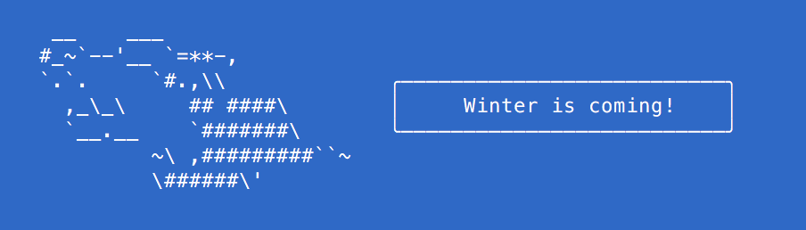

> Tell the wolf what to say

Like [cowsay](http://en.wikipedia.org/wiki/Cowsay), but less cow.




## Install

```
$ npm install --save wolfsay
```


## Usage

```js
const wolfsay = require('wolfsay');

console.log(wolfsay('Winter is coming!'));

/*
   __    ___                  
   #_~`--'__ `=**-,            
   `.`.     `#.,\\             ╭──────────────────────────╮
     ,_\_\     ## ####\        │     Winter is coming!    │
     `__.__    `#######\       ╰──────────────────────────╯
            ~\ ,#########``~   
            \######\'          

```

*You can style your text with [chalk](https://github.com/sindresorhus/chalk) before passing it to `wolfsay`.*


## CLI

```
$ npm install --global wolfsay
```

```
$ wolfsay --help

  Usage
    wolfsay <string>
    wolfsay <string> --maxLength 8
    echo <string> | wolfsay

  Example
    wolfsay 'Woof woof'

    __    ___                  
   #_~`--'__ `=**-,            
   `.`.     `#.,\\             ╭──────────────────────────╮
     ,_\_\     ## ####\        │        Woof woof!        │
     `__.__    `#######\       ╰──────────────────────────╯
            ~\ ,#########``~   
            \######\'                                   

```


## License

[BSD license](http://opensource.org/licenses/bsd-license.php)
Copyright (c) Google
